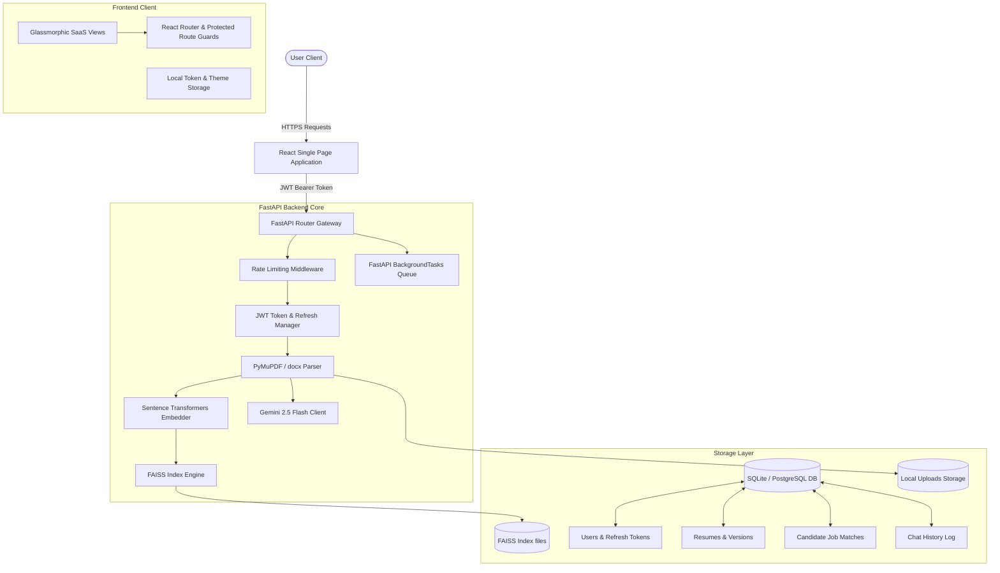
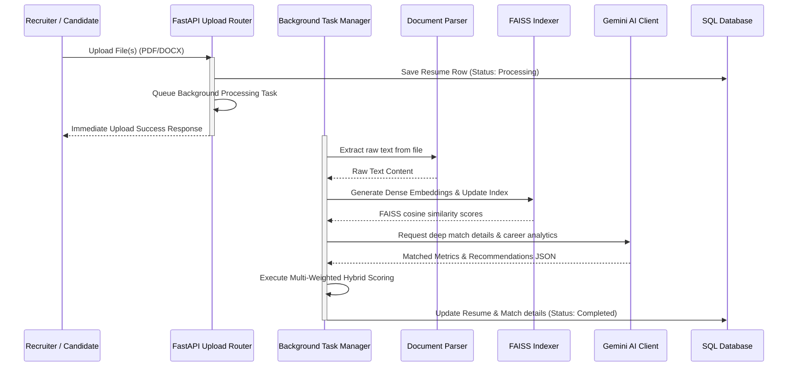
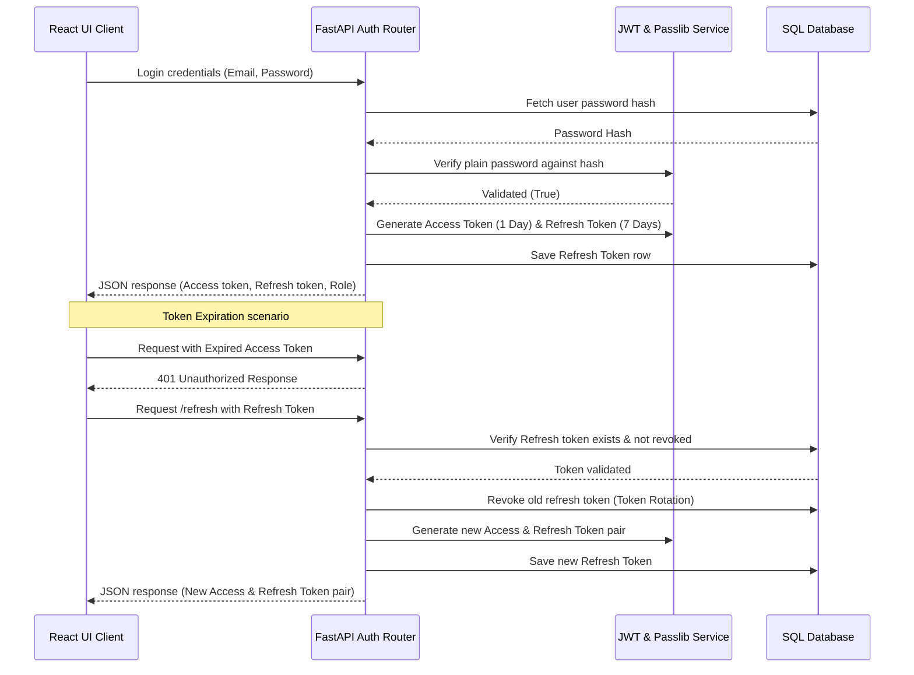
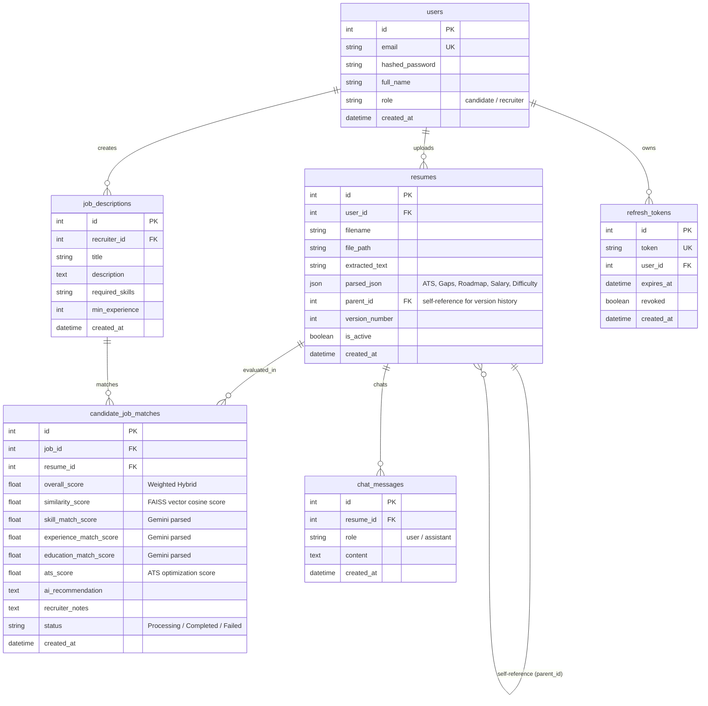

<div align="center">
  
  # 🔍 AI Resume Screener & Semantic Ranking Platform
  
  [](LICENSE)
  [](backend/requirements.txt)
  [](frontend/package.json)
  [](https://ai.google.dev/)
  [](backend/requirements.txt)

  An enterprise-grade, high-velocity AI talent screening and resume optimization portal.
</div>

---

## 📖 Project Overview
This platform serves as a modern applicant matching workspace, delivering dual-portal solutions for candidates seeking to bypass screening algorithms and recruiters filtering applicants at high volumes.

Traditional keyword matching systems fail because they ignore semantics. By combining **Sentence Transformers (`all-MiniLM-L6-v2`)**, **FAISS Vector Indexes**, and **Google Gemini 2.5 Flash API**, this application provides automated structured parsing, gap analysis, career suggestions, and a hybrid multi-weighted overall matching score.

---

## 🎯 Problem Statement & Solution

### The Problem
- **Recruiters**: Spending dozens of hours manually reviewing unaligned resumes, or relying on outdated keyword ATS tools that reject highly qualified candidates who lack exact phrase matches.
- **Candidates**: Submitting resumes into black-hole tracking systems with no insight into keyword gaps, formatting alignment, or styling incompatibilities.

### The Solution
- **Semantic Mapping**: Candidates are ranked by actual semantic compatibility of their skills and experience using high-density vector representation rather than text matches.
- **Background Scaling**: Resumes are parsed in the background via FastAPI workers, allowing recruiters to drag and drop hundreds of files at once without timing out.
- **Generative Refinement**: Candidates receive actionable rewrite recommendations, learning roadmaps, and career estimations, and can discuss their resume structure directly with an AI coach.

---

## 🚀 Advanced Features

### 👤 Candidate Dashboard
- **Resume Rewrite Assistant**: Provides section-by-section original vs. optimized phrasing comparisons with detail logs on why the rewrite performs better in ATS algorithms.
- **Skill Gap & Learning Roadmap**: Identifies present vs. missing technologies, detailing step-by-step actions and timelines to acquire missing items.
- **Career Directions & Salary Estimator**: Suggests suited roles, fit percentages, market salary brackets (Low, Median, High), and technical assessment difficulty ratings.
- **AI Career Coach Chatbot**: Offers a database-backed chat interface allowing candidates to discuss their resume optimization interactively.
- **Version Log History**: Uploads and compares multiple iterations of the same resume, tracking past formatting ATS scores.

### 💼 Recruiter Portal
- **Hybrid Matching Engine**: Scores candidates using a weighted formula:
  $$\text{Overall Fit} = (40\% \times \text{FAISS Vector Similarity}) + (25\% \times \text{Skills Match}) + (15\% \times \text{Experience Match}) + (10\% \times \text{Education Match}) + (10\% \times \text{ATS Score})$$
- **Bulk Screen Dropbox**: Process hundreds of files concurrently inside asynchronous FastAPI worker tasks.
- **Recruiter Notes Generator**: Produces summarized qualitative hiring highlights, candidate pros/cons, and recommended interview questions.
- **Side-by-Side Comparison Matrix**: Selects multiple profiles to review side-by-side technical fit, pros, cons, and final recruitment rank.
- **Analytics Dashboard**: Aggregates demographics including top present skills, common skill gaps, average ATS score, and distribution graphs.

---

## 🏗️ System Architecture & Workflows

### Complete Platform Architecture


### Resume Processing Pipeline


### Authentication Flow


---

## 🗄️ Database ER Diagram


---

## 🔒 Security Features
- **Token Rotation**: Implements JWT Access and Refresh Tokens rotation policies, invalidating previous refresh tokens on new exchanges.
- **In-Memory Rate Limiting**: Gated API endpoints limit anonymous or active user IPs to 120 calls per minute to block DDoS attacks.
- **Input Sanitization**: Gated FastAPI schemas block SQL injection, cross-site scriptings, and execute string sanitization before saving records.
- **File Validation**: Strict file parser verification restricts mime types and extensions to only valid `.pdf` and `.docx` payloads.

---

## ⚡ Performance Optimizations
- **FastAPI Background Tasks**: Heavy parsing, embeddings indexing, and Gemini queries execute inside background worker threads, keeping HTTP response times under 300ms.
- **FAISS Cosine FlatIP index**: Dense 384-dimension vectors generated by `all-MiniLM-L6-v2` utilize L2-normalized embeddings, resolving similarities via flat inner product (cosine similarity) calculations under 5ms.
- **Client Code Splitting & Caching**: Vite splits major dashboards and Recharts panels into dynamically loaded modules. Access and refresh token configurations are cached in secure localStorage buffers.

---

## ⚙️ Environment Variables
Configure your variables inside a `.env` file located in the project root:
```env
# Gemini configuration
GEMINI_API_KEY=your_google_gemini_api_key_here

# Backend Database details
DATABASE_URL=sqlite:///./database/resume_screener.db

# JWT cryptography configuration
JWT_SECRET=supersecretjwtkeyforresumeanalysisapp
ACCESS_TOKEN_EXPIRE_MINUTES=1440

# Frontend configurations
VITE_API_URL=http://localhost:8000
```

---

## 🛠️ Installation & Setup

### Docker setup (Recommended)
Launch the application with Docker and Docker Compose:
```bash
# Build and run containers in detached mode
docker-compose up --build -d
```
Access the portals:
- **Frontend Dashboard**: http://localhost:5173
- **FastAPI OpenAPI Reference**: http://localhost:8000/docs

### Local manual installation

#### 1. Setup Backend Server
```bash
cd backend
python -m venv venv
source venv/bin/activate # On Windows use: venv\Scripts\activate
pip install -r requirements.txt
python app/main.py
```

#### 2. Setup Frontend client
```bash
cd frontend
npm install
npm run dev
```

---

## 🧪 Testing Suite
Execute the pytest suite to confirm system and database compilation:
```bash
cd backend
pytest tests/test_backend.py -v
```

---

## 🗺️ Roadmap
- [ ] Connect PostgreSQL adapter models for deployment scale.
- [ ] Integrate third-party email notifications (e.g. SendGrid) to auto-alert shortlisted candidates.
- [ ] Incorporate custom weights adjustments directly from the Recruiter matching dashboard.

---

## 📄 License
This project is licensed under the MIT License - see the [LICENSE](LICENSE) file for details.
